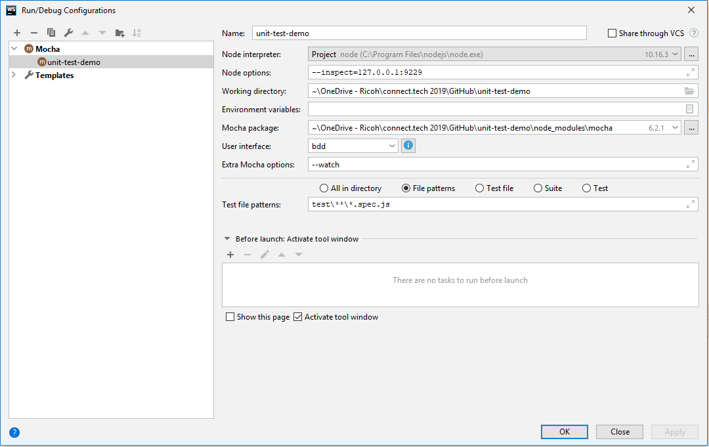

# unit-test-demo

## Where this code came from

This code is an obfuscated version of a couple files taken from a real
application. This application has no unit tests. It also uses its own
handmade framework. 

## Dev Dependencies

The devDependencies list some tools for use in Mocha / Chai / Sinon with
JSDOM for UI code. Not used in this demo are:
- rewire: an awesome way to insert mocks into your Node.js tests
- nyc: for code coverage
- chai-as-promised: useful syntax for unit testing promises

## Setup files
The file `setup.js` sets up for Node file unit testing. You can include
this at the top of any file to run its tests as long as it doesn't need 
a window. 

The file `ui-setup.js` sets up for browser file unit testing. You can 
include this at the top of any UI file to prepare for UI simulation.

## Canary file
The canary file lets us know that the unit test environment is 
correctly installed. It provides a sniff test so you'll know that test
issues come from your code, not the environment. 

## Debugging
The instructions for debugging in JSDOM are sparse, but the setup 
provided here, with specific URLs set in the `ui-setup.js` file as well 
as the `--inspect=127.0.0.1:9229` parameter, works OK in Dev-Tools-based
debugging.

The setup for Webstorm debugging, which works very well: 

## JSDOM window creation
The reason I use "before"/"after" statements to create windows in JSDOM
rather than "beforeEach"/"afterEach" is because the proliferation of 
windows in a single test makes debugging much more confusing. Another 
reason is that it gives me a better chance of finding out whether there
are memory leaks in the code, if I give the tests themselves a chance
to leak memory rather than discarding the window and creating a new one.
